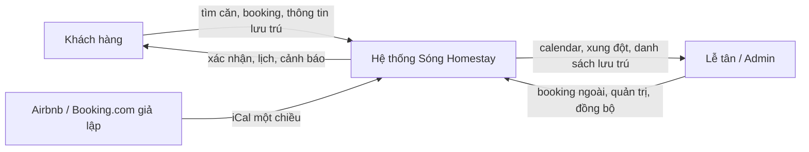
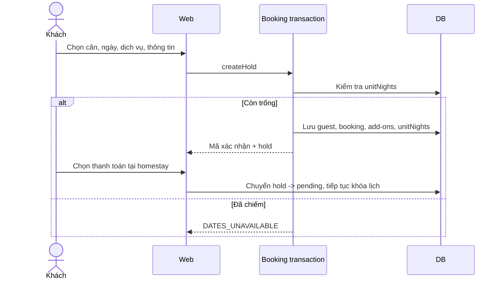
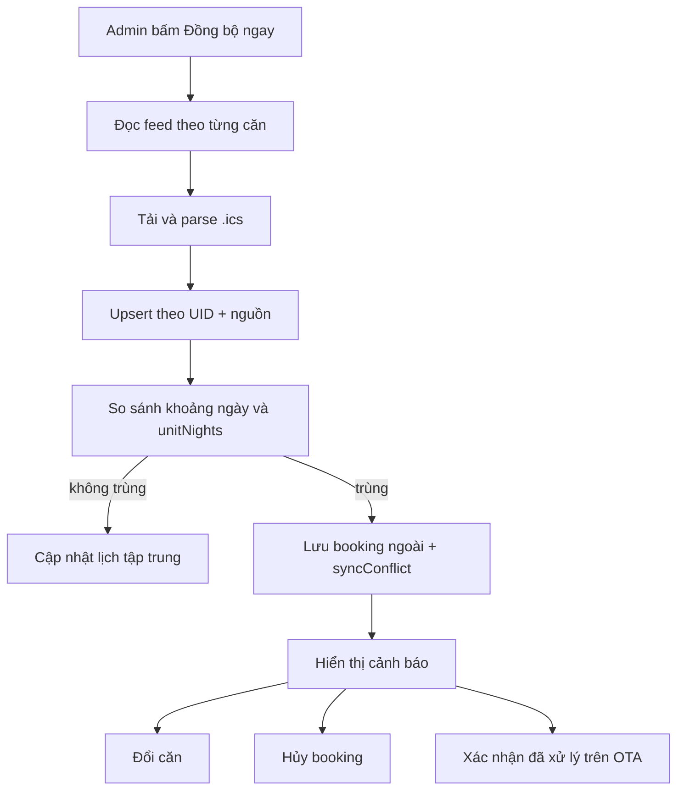

# Data Flow Diagrams

## Context diagram

```mermaid
flowchart LR
  Guest[Khách hàng] -->|tìm căn, booking, thông tin lưu trú| System[Hệ thống Sóng Homestay]
  Admin[Lễ tân / Admin] -->|booking ngoài, quản trị, đồng bộ| System
  OTA[Airbnb / Booking.com giả lập] -->|iCal một chiều| System
  System -->|xác nhận, lịch, cảnh báo| Guest
  System -->|calendar, xung đột, danh sách lưu trú| Admin
```

## DFD — booking trực tiếp

```mermaid
sequenceDiagram
  actor Guest as Khách
  participant Web
  participant Booking as Booking transaction
  participant DB
  Guest->>Web: Chọn căn, ngày, dịch vụ, thông tin
  Web->>Booking: createHold
  Booking->>DB: Kiểm tra unitNights
  alt Còn trống
    Booking->>DB: Lưu guest, booking, add-ons, unitNights
    Booking-->>Web: Mã xác nhận + hold
    Guest->>Web: Chọn thanh toán tại homestay
    Web->>DB: Chuyển hold -> pending, tiếp tục khóa lịch
  else Đã chiếm
    Booking-->>Web: DATES_UNAVAILABLE
  end
```

## DFD — iCal và double booking

```mermaid
flowchart TD
  Click[Admin bấm Đồng bộ ngay] --> Targets[Đọc feed theo từng căn]
  Targets --> Fetch[Tải và parse .ics]
  Fetch --> Upsert[Upsert theo UID + nguồn]
  Upsert --> Compare[So sánh khoảng ngày và unitNights]
  Compare -->|không trùng| Calendar[Cập nhật lịch tập trung]
  Compare -->|trùng| Conflict[Lưu booking ngoài + syncConflict]
  Conflict --> Alert[Hiển thị cảnh báo]
  Alert --> Move[Đổi căn]
  Alert --> Cancel[Hủy booking]
  Alert --> Ack[Xác nhận đã xử lý trên OTA]
```

